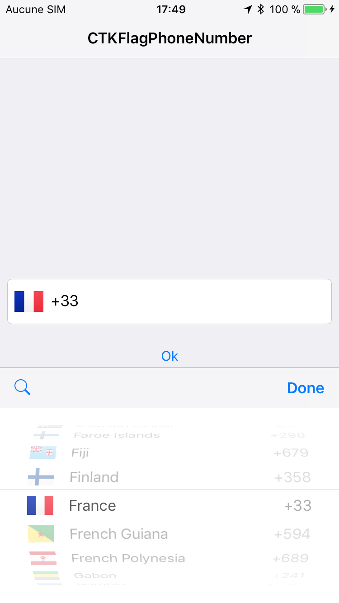
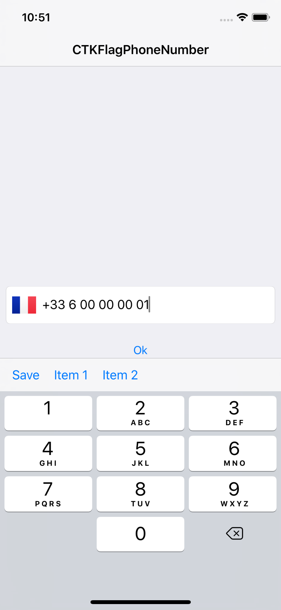

# FlagPhoneNumber

FlagPhoneNumber is a phone number textfield with a fancy country code picker.   

[](https://travis-ci.org/chronotruck/FlagPhoneNumber)
[](http://cocoapods.org/pods/FlagPhoneNumber)
[](http://cocoapods.org/pods/FlagPhoneNumber)
[](http://cocoapods.org/pods/FlagPhoneNumber)
[](https://developer.apple.com/swift)

## 🌅 Screenshot
  


## 🌍 Localization

Country names are displayed according to the phone language

## 📲 Example

To run the example project, clone the repo, and run `pod install` from the Example directory first.

## ⬇️ Installation

FlagPhoneNumber is available through [CocoaPods](http://cocoapods.org) and [Carthage](https://github.com/Carthage/Carthage). 

### Carthage

Simply add in your `Cartfile` the following line: 

```ruby
github "chronotruck/FlagPhoneNumber"
```

### Cocoapods

Simply add in your `Podfile` the following line:

```ruby
pod "FlagPhoneNumber"
```

### Manually

Simply import the Sources repository in your project.

#### 👴🏻 Objective-C is supported 


## 🗺 Usage

You can instantiate it in storyboards/xibs or programmatically:

```swift
let phoneNumberTextField = FPNTextField(frame: CGRect(x: 0, y: 0, width: view.bounds.width - 16, height: 50))

// You can change the chosen flag then set the phone number
phoneNumberTextField.setFlag(for: .FR)
phoneNumberTextField.set(phoneNumber: "0600000001")

// Or directly set the phone number with country code, which will update automatically the flag image
phoneNumberTextField.set(phoneNumber: "+33600000001")
```

## 🚨 FPNTextFieldDelegate

FPNTextFieldDelegate inherites from UITextFieldDelegate so nothing change:

```swift
phoneNumberTextField.delegate = self
```

It provides you three methods:

```swift
extension YourViewController: FPNTextFieldDelegate {

   /// The place to present/push the listController if you choosen displayMode = .list
   func fpnDisplayCountryList() {
      let navigationViewController = UINavigationController(rootViewController: listController)
      
      present(navigationViewController, animated: true, completion: nil)
   }

   /// Lets you know when a country is selected 
   func fpnDidSelectCountry(name: String, dialCode: String, code: String) {
      print(name, dialCode, code) // Output "France", "+33", "FR"
   }

   /// Lets you know when the phone number is valid or not. Once a phone number is valid, you can get it in severals formats (E164, International, National, RFC3966)
   func fpnDidValidatePhoneNumber(textField: FPNTextField, isValid: Bool) {
      if isValid {
         // Do something...         
         textField.getFormattedPhoneNumber(format: .E164),           // Output "+33600000001"
         textField.getFormattedPhoneNumber(format: .International),  // Output "+33 6 00 00 00 01"
         textField.getFormattedPhoneNumber(format: .National),       // Output "06 00 00 00 01"
         textField.getFormattedPhoneNumber(format: .RFC3966),        // Output "tel:+33-6-00-00-00-01"
         textField.getRawPhoneNumber()                               // Output "600000001"
      } else {
         // Do something...
      }
   }
}
```

## 🎨 Customization

By default, the picker view is showed but you can display the countries with a list view controller:

```swift
var listController: FPNCountryListViewController = FPNCountryListViewController(style: .grouped)

phoneNumberTextField.displayMode = .list // .picker by default

listController.setup(repository: textField.countryRepository)
listController.didSelect = { [weak self] country in
self?.textField.setFlag(countryCode: country.code)
```

Don't forget to implement the `fpnDisplayCountryList`:

```swift
func fpnDisplayCountryList() {
   let navigationViewController = UINavigationController(rootViewController: listController)

   listController.title = "Countries"

   self.present(navigationViewController, animated: true, completion: nil)
}
```

FlagKit is used by default but you can customize the list with your own flag icons assets:
```swift
// Be sure to set it before initializing a FlagPhoneNumber instance.
Bundle.FlagIcons = YOUR_FLAG_ICONS_BUNDLE
```

You can change the size of the flag button:
```swift
phoneNumberTextField.flagButtonSize = CGSize(width: 44, height: 44)
```

You can customize the inputAccessoryView of the textfield:
```swift
phoneNumberTextField.textFieldInputAccessoryView = getCustomTextFieldInputAccessoryView(with: items)
```

You can also customize the flag button's properties:
```swift
// This will freeze the flag.
// Only one particular country's phone numbers will be formatted and validated.
// You can set the country by setting the flag as shown earlier.
phoneNumberTextField.flagButton.isUserInteractionEnabled = false
```

You can have in the placeholder an example of a phone number according to the selected country or have your own placeholder:
```swift
phoneNumberTextField.hasPhoneNumberExample = false // true by default
phoneNumberTextField.placeholder = "Phone Number"
```

You can choose which country can appears in the list:
```swift
phoneNumberTextField.setCountries(including: [.FR, .ES, .IT, .BE, .LU, .DE])
```

Or exclude countries from the list:
```swift
phoneNumberTextField.setCountries(excluding: [.AM, .BW, .BA])
```

You can choose to display the country phone code in the picker or in the list view controller:
```swift
phoneNumberTextField.pickerView.showCountryPhoneCode = false // true by default
listController.showCountryPhoneCode = false // true by default
```

You can reuses `FPN` classes as you see fit !

## ☕️ Conception
This library uses libPhoneNumber-iOS library (https://github.com/iziz/libPhoneNumber-iOS)

Open source time proudly sponsored by Chronotruck.

## 💁🏻‍♂️ Author
grifas, aurelien.grifasi@chronotruck.com

Don't hesitate to contact me or make a pull request to upgrade this library.

## 📝 License
FlagPhoneNumber is available under the Apache license. See the LICENSE file for more info.
