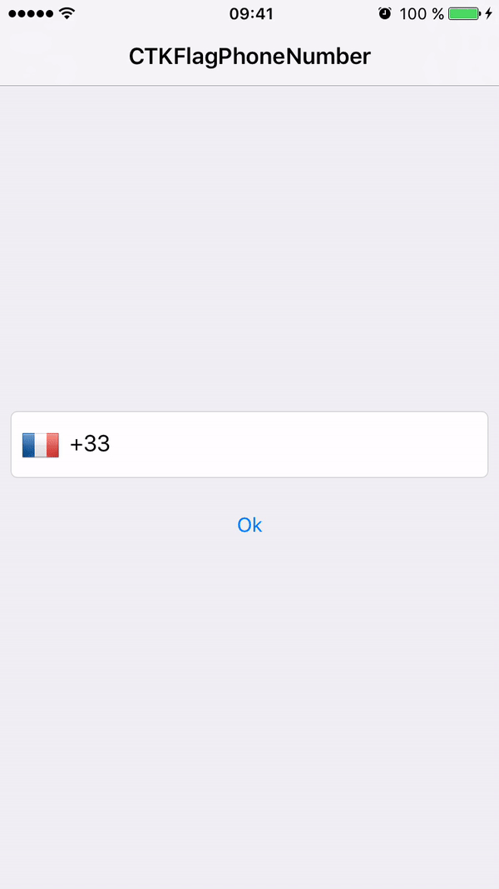

# CTKFlagPhoneNumber

CTKFlagPhoneNumber is a phone number textfield with a fancy country code picker.   

[](https://travis-ci.org/chronotruck/CTKFlagPhoneNumber)
[](http://cocoapods.org/pods/CTKFlagPhoneNumber)
[](http://cocoapods.org/pods/CTKFlagPhoneNumber)
[](http://cocoapods.org/pods/CTKFlagPhoneNumber)
[](https://developer.apple.com/swift)

## Screenshot



## Example

To run the example project, clone the repo, and run `pod install` from the Example directory first.

## Requirements

## Installation

CTKFlagPhoneNumber is available through [CocoaPods](http://cocoapods.org). To install
it, simply add the following line to your Podfile:

```ruby
pod "CTKFlagPhoneNumber"
```

## Usage

You can instance it in storyboards or .xibs.

You can programmatically change the choosen flag:
```swift
phoneNumberTextField.setFlag(with: "FR")
```

and the phone number:
```swift
phoneNumberTextField.set(phoneNumber: "0600000001")
```
This function updates the flag according to the phone number

You can also get the phone number to E164 format:
```swift
print(phoneNumberTextField.getPhoneNumber())
// Output: +33600000001
```

## Customization

FlagKit is used by default but you can customize the list with your own flag icons assets:
```swift
Bundle.FlagIcons = YOUR_FLAG_ICONS_BUNDLE
```
Be sure to set it before initializing a CTKFlagPhoneNumber instance.

## Conception
This library is high inspired of MRCountryPicker library and use libPhoneNumber-iOS library.
https://github.com/xtrinch/MRCountryPicker / https://github.com/iziz/libPhoneNumber-iOS 

## Author

grifas, aurelien.grifasi@chronotruck.com

Don't hesitate to contact me or make a pull request to upgrade this library.

## License

CTKFlagPhoneNumber is available under the Apache license. See the LICENSE file for more info.
